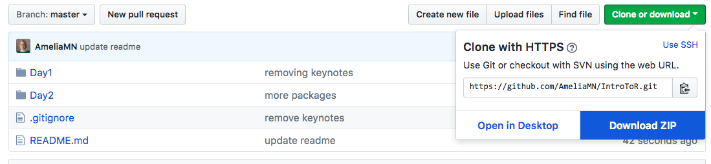

This is the repo for the two-day short course, *"Introduction to R & RStudio"* given at `rstudio::conf(2018)` January 31 and February 1, 2018. 

## About the materials

Description: This is a two-day hands on workshop designed for people who are brand new to R & RStudio and who learn best in person. You will learn the basics of R and data science, and practice using the RStudio IDE (integrated development environment) and R Notebooks. We will have a team of TAs on hand to show you the ropes, and help you out when you get stuck.

These materials were based on Introduction to R (2014), and  <a xmlns:dct="http://purl.org/dc/terms/" href="https://github.com/rstudio/master-the-tidyverse" rel="dct:source">https://github.com/rstudio/master-the-tidyverse</a> (2017). They are intended to be appropriate for people who have never used R before. 

To download the materials, click on "Clone or download" and select "Download ZIP"

Both [day1](https://github.com/AmeliaMN/IntroToR/tree/master/Day1) and [day2](https://github.com/AmeliaMN/IntroToR/tree/master/Day2) include folders of code, slides, cheatsheets, and (on day 2) data. Files should be consistently named so you can see the correspondence. For example, [02-Visualization.pdf](https://github.com/AmeliaMN/IntroToR/blob/master/Day1/slides/02-Visualization.pdf) corresponds with [02-Visualization.Rmd](https://github.com/AmeliaMN/IntroToR/blob/master/Day1/code/02-Visualization.Rmd) and [02-Visualization-Solutions.Rmd](https://github.com/AmeliaMN/IntroToR/tree/master/Day1/code/solutions)

Day 1
- 01-Introduction (what is R, what is RStudio)
- 02-Visualization (visualizing data using `ggplot2`)
- 03-DataTypes (vectors, matrices, data frames, vector types, coercion)
- 04-Syntax (selecting rows and columns using base R and `dplyr`-- compare/contrast)

Day 2
- 06-Import (importing data using base R and `readr`-- compare/contrast)
- 07-BestPractices (cleaning up your workspace, ideas for organization, things to read)
- 08-Transform (more `dplyr`, making many-to-few and many-to-many transformations, joining data)
- 09-Tidy (skipped in the workshop, covers tidying data using `gather()` and `spread()`)
- 10-Model (linear modeling, `broom`, logistic regression)
- 11-GoingForward (installing R and RStudio locally, learning more and getting help)

## Instructor Info

Amelia McNamara

-   [amcnamara@smith.edu](amcnamara@smith.edu)
-   [http://www.science.smith.edu/~amcnamara/](http://www.science.smith.edu/~amcnamara/)
-   @[AmeliaMN](http://www.twitter.com/AmeliaMN)

## License

*Intro to R & RStudio* by <a xmlns:cc="http://creativecommons.org/ns#" href="https://github.com/AmeliaMN/IntroToR" property="cc:attributionName" rel="cc:attributionURL">Amelia McNamara</a> is licensed under a <a rel="license" href="http://creativecommons.org/licenses/by/4.0/">Creative Commons Attribution 4.0 International License</a>.  Based on Introduction to R (2014), and  <a xmlns:dct="http://purl.org/dc/terms/" href="https://github.com/rstudio/master-the-tidyverse" rel="dct:source">https://github.com/rstudio/master-the-tidyverse</a> (2017).
